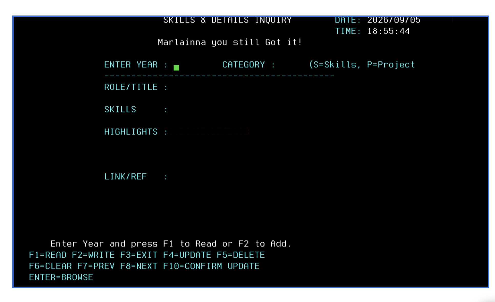
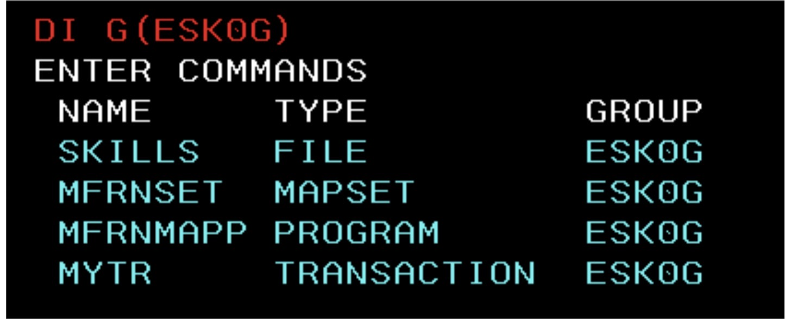
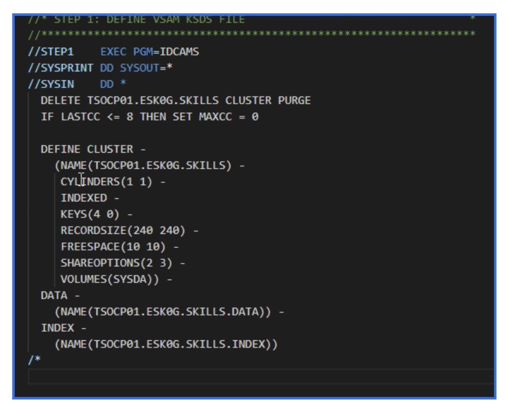
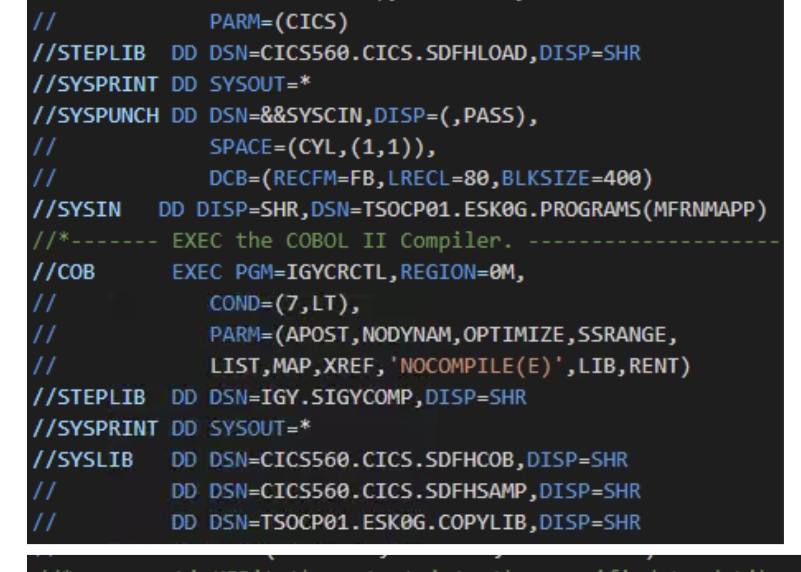
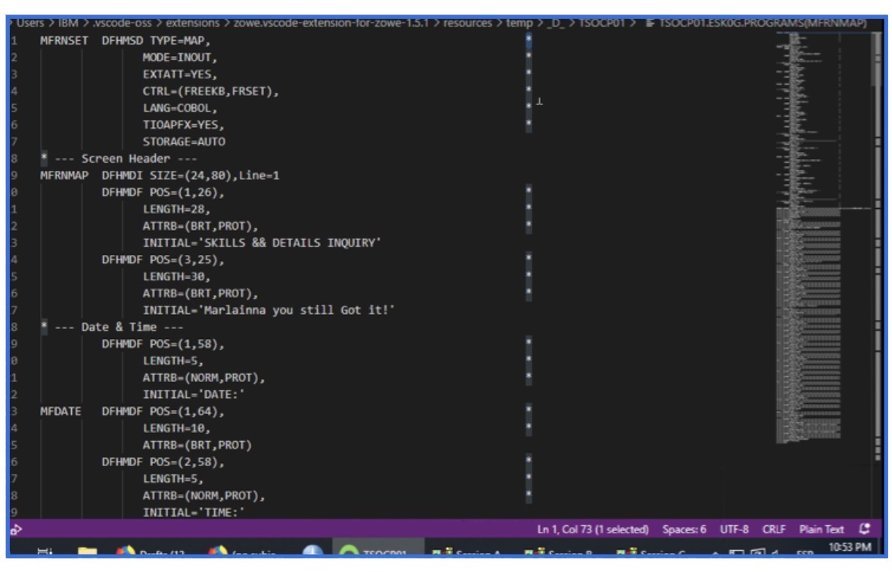
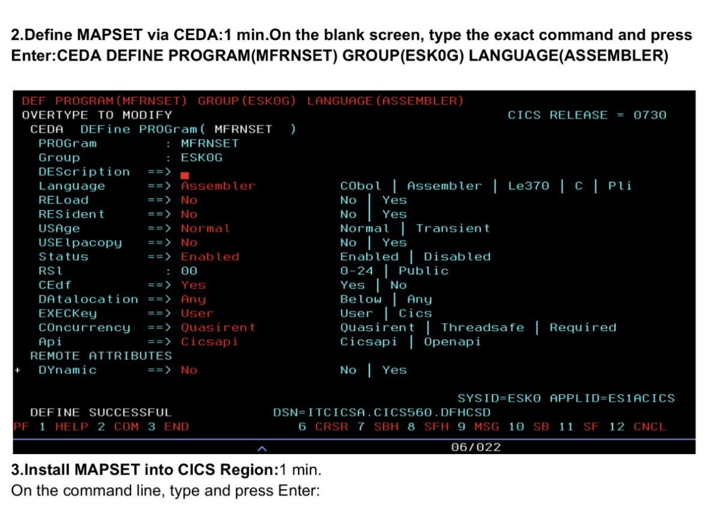

# CICS-Legacy-to-Modern-CRUD

Modernizing a COBOL CRUD Application: Mainframe Screens to Modern Architecture.

  
   
  <em>CICS Mainframe Modernization Project (Sept 2026)</em>

## Overview

This repository documents the modernization path for a legacy COBOL CRUD (Create, Read, Update, Delete) application running under CICS (Customer Information Control System) on an IBM z/OS mainframe. The project transitions a fixed-field terminal application into a flexible, service-oriented architecture.

---

## Technical Components & File Directory

This project combines traditional mainframe assets with modern DevOps tooling. The source code is organized as follows:
## 📸 Project Resources

Below is a snapshot of the resources created during the CICS Legacy-to-Modern project, including the COBOL program, BMS map, JCL, VSAM definitions, CICS commands, troubleshooting documentation, and development tools.

### [ VS Code / TSO/ISPF Tools](#vscode-tools)

This section includes links and cross-references for developing with IBM Z Open Editor:

| Asset | Description |
| :--- | :--- |
| **Code Links PDF** | Documentation linking modern editor features to TSO/ISPF counterparts. |
| **MAP: JCL** | JCL source for BMS Mapset compilation. |
| **Copybook Source** | Shared COBOL definitions (Linkage Section). |

---

### [ TSO/ISPF & VSAM Data](#mainframe-source)

Source and definitions for the mainframe components:

- `mainframe/jcl/VSAM_DEF.jcl`: VSAM KSDS cluster definition.
- `mainframe/cobol/CICS_CRUD.cbl`: Main COBOL CICS program source.
- `mainframe/bms/CICS_MAP.bms`: Basic Mapping Support mapset source.

### VSAM Operations & Workflows

Documented application flow and command usage for database operations:

| Operation | Command Example | Documentation |
| :---: | :--- | :--- |
| **ADD** | `EXEC CICS WRITE` | [Detailed Workflow](images/VSAM_ADD.png) |
| **DELETE** | `EXEC CICS DELETE` | [Detailed Workflow](images/VSAM_DELETE.png) |
| **UPDATE** | `EXEC CICS REWRITE` | [Detailed Workflow](images/VSAM_UPDATE.png) |
| **BROWSE** | `EXEC CICS STARTBR`/`READNEXT` | [Detailed Workflow](images/VSAM_BROWSE.png) |

---

## [ Mainframe Commands Used](#commands)

The following CICS commands are utilized for testing, debugging, and system management. Click the links for application-specific usage guides:

### [CICS Troubleshooting Guide (PDF)](./Troubleshooting.pdf)

  
   
  <em>CICS Mainframe Modernization Project (Sept 2026)</em>

Quick-reference document covering:

* `CEDA DEFINE` and `INSTALL` commands for mapsets and libraries [[PDF](./Troubleshooting.pdf)][cite: 1]
* `CEMT SET PROGRAM NEWCOPY` execution and status checks [[PDF](./Troubleshooting.pdf)][cite: 1]
* Resolving `LOAD FAILED` errors and setting up custom `DSNAME` allocations [[PDF](./Troubleshooting.pdf)][cite: 1]

---

## Modernized Components

We have integrated the following modernized components:

*   **Container-Based Services** for elastic scaling.
*   **Web Interface (HTML/CSS/JS)** providing a responsive front-end.
*   **REST APIs (Python Flask)** for secure, flexible service calls.
*   **PostgreSQL DB** for high-performance open-source data management.

## Migration Steps

The application transition followed these logic steps:

1.  **Map Field Definition:** Apply unprotected status to key screen fields.
2.  **Data Retrieval:** 'Enter Year' function returns all other record fields.

## Project Transition

### 📸 Project Transition

**BEFORE: Original Screen Capture**  

Check out the update on [LinkedIn](https://www.linkedin.com/feed/update/urn:li:ugcPost:7502364357662658560).

**AFTER: Modernized Screen Capture**  

## Project Status

This modernization effort is currently:

  **Wrapping Up Soon**
   
  

<table border="0" width="100%">
<tr>
<td width="50%" valign="top">

### 🛠️ VS Code / TSO/ISPF Tools
* [Code Links PDF](./docs/code-links.pdf)
* [MAP: JCL](./jcl/map.jcl)
* [Copybook Source](./cobol/copybooks/)

---

### 💾 TSO/ISPF & VSAM Data
* **VSAM:** JCL
* **Program Source**
* **BMS Mapset Source**
* **VSAM Operations:** `ADD`, `DELETE`, `BROWSE`, `UPDATE`

---

### 💻 Mainframe Commands Used
* `CEMT`, `CEDF`: Brief command usage
* `CEDF`: Operation used commands usage
* `CEMT`: Add three field command usage
* `BROWSE`: Add/Delete usage
* `UPDATE`: Update/Find command usage

---

### 🎥 CICS Demo (Sept 2026)

</td>
<td width="50%" valign="top">

### 🚀 Modernized Components
**Modernized components added:**
* Container-Based Services
* Web Interface (HTML/CSS/JS)
* REST APIs (Python Flask)
* PostgreSQL DB

---

### 📋 Migration Steps
`1. Apply unprotected to key fields` ➔ `2. Enter Year: Returns other fields`

---

### 📸 Project Transition

### 📸 Project Transition

**BEFORE: Original Screen Capture**  

Here is my latest project update:

Check out the repository below for details.  

**AFTER: Modernized Screen Capture**  

---

### 📊 Example of issues I experienced
** VSAM Record Update Issue**
 
Problem: When I updated a record, fields like Role/Title and Skills were getting blanked out.
Cause: The program was moving the screen data before the VSAM READ UPDATE, which replaced my changes with the old record.
Fix: I changed the order so the screen data is moved after the READ UPDATE and before the REWRITE. This allowed my updated information to save correctly.

**VSAM Record Layout Issue**
 
Problem: Some data was shifting, getting truncated, or not saving correctly.
Cause: The Working-Storage record layout didn't fully match the VSAM record structure.
Fix: I aligned the record layout to the VSAM file at 205 bytes, making sure the fields matched correctly when moving data between the screen and VSAM

</td>
</tr>
</table>
---

[Github Repository Mockup Visualization Reference](images/README_Storyboard.png)
