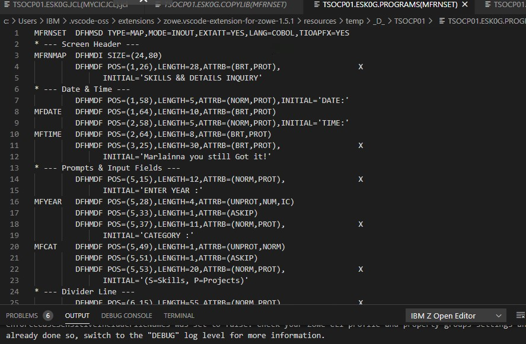
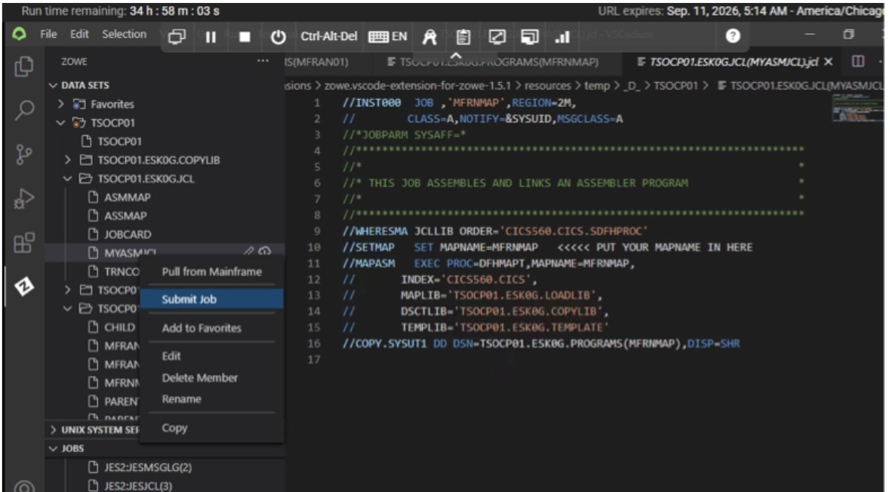
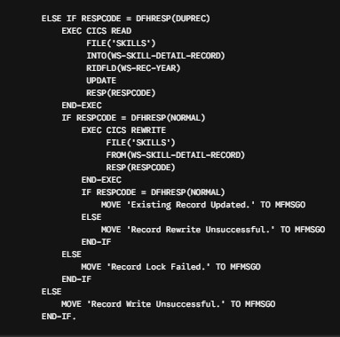
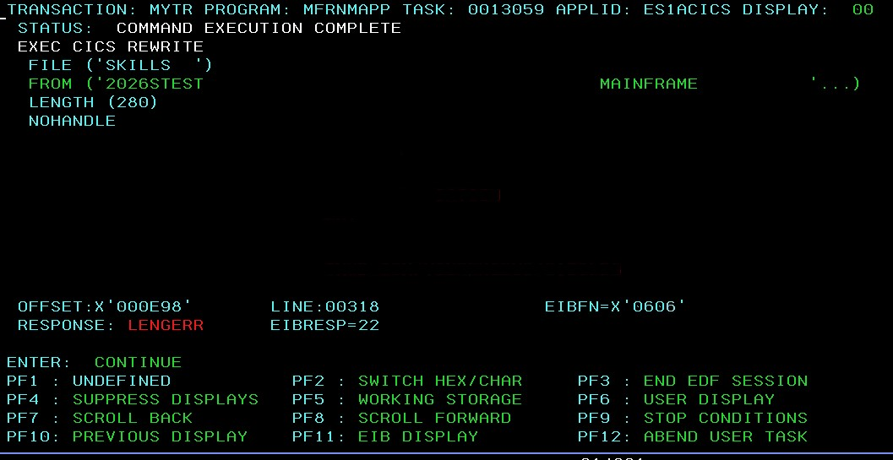
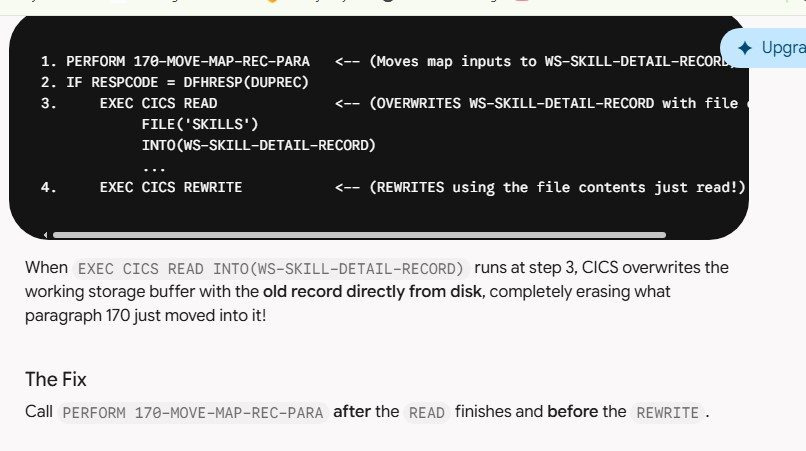
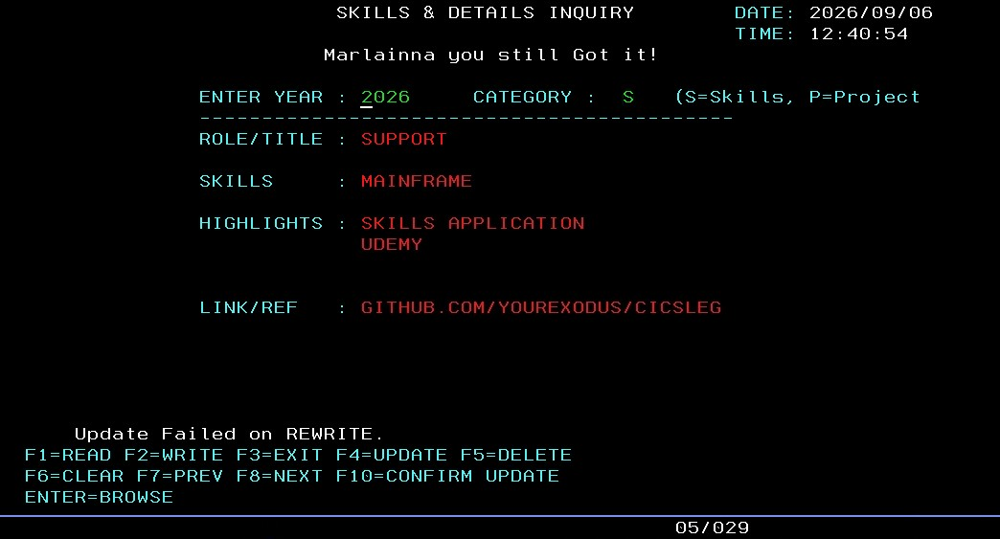
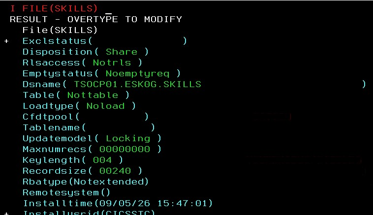
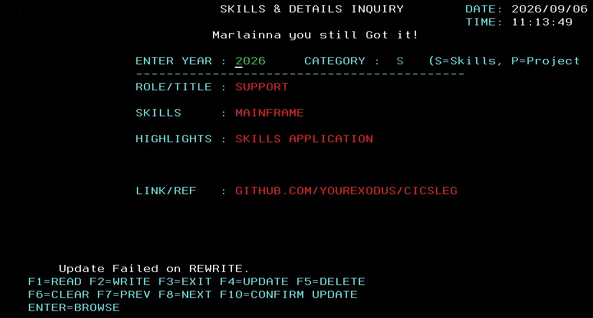

# CICS-Legacy-to-Modern-CRUD

## Modernizing a COBOL CRUD Application: Mainframe Screens to Modern Architecture

  
   
  <em>CICS Mainframe Modernization Project — September 2026</em>

---

# What Happened

This project documents my hands-on work rebuilding, testing, debugging, and modernizing a legacy COBOL CRUD application running under CICS on an IBM z/OS mainframe.

The goal was not simply to rewrite the application.

I wanted to demonstrate the actual work involved in taking a legacy mainframe application from:

**BMS Map → JCL → COBOL → CICS Definitions → Testing → Debugging → Working Application**

The project includes the mainframe development process, troubleshooting, VSAM record processing, CICS commands, and the transition toward a modern architecture.

---

# 🔧 Mainframe Build & Test Process

<table>
<tr>
<th width="50%">WHAT HAPPENED</th>
<th width="50%">EVIDENCE / RESULT</th>
</tr>

<tr>
<td valign="top">

## STEP 1 — Build the BMS MAP

The first step was creating and modifying the BMS map used by the CICS application.

The map defines the fields, screen positions, attributes, and terminal layout used by the application.

I also worked through map formatting and compilation issues while getting the screen into the structure required by the COBOL program.

</td>

<td valign="top">

### BMS MAP

 

Additional project resource:

</td>
</tr>

<tr>
<td valign="top">

## STEP 2 — Run the MAP JCL

The BMS source had to be processed through JCL so that the mapset and associated generated resources could be created for the CICS application.

This step was part of rebuilding the mainframe application environment rather than simply editing COBOL.

</td>

<td valign="top">

### MAP / JCL DEVELOPMENT

</td>
</tr>

<tr>
<td valign="top">

## STEP 3 — Connect the COBOL Program to the MAP

The COBOL program is connected to the CICS application resources using the required names and definitions.

The program is connected using:

- **Copybook Name** — provides the generated MAP field definitions to the COBOL program.
- **Transaction ID** — identifies the CICS transaction used to invoke the program.
- **VSAM Nickname** — identifies the VSAM file used by the program for CRUD processing.

These definitions allow the COBOL program, CICS transaction, MAP, and VSAM file to work together.

The COBOL CICS program uses the generated map and copybook definitions to communicate with the terminal screen.

This is where the screen fields, COBOL working-storage definitions, and CICS application logic have to line up correctly.

</td>

<td valign="top">

### COBOL / CICS PROGRAM

</td>
</tr>

<tr>
<td valign="top">

## STEP 4 — Compile & Link the Program

The COBOL program and supporting resources must be compiled and linked before they can be executed by CICS.

This required working with JCL and the mainframe development environment.

</td>

<td valign="top">

### PROGRAM BUILD

</td>
</tr>

<tr>
<td valign="top">

## STEP 5 — Define & Install CICS Resources

After building the application components, I worked with CICS resource definitions and installation commands.

This included working with commands such as:

`CEDA DEFINE`

`CEDA INSTALL`

`CEMT`

These resources are what allow CICS to locate and execute the application components.

</td>

<td valign="top">

### CICS RESOURCE CONFIGURATION

 

📄 [CICS Troubleshooting Guide](./Troubleshooting.pdf)

</td>
</tr>

<tr>
<td valign="top">

## STEP 6 — Test & Debug

Testing was a major part of the project.

I used CEDF to step through the CICS program and investigate problems during execution.

This included troubleshooting:

- CICS resource problems
- MAP loading issues
- VSAM processing
- Record layout problems
- UPDATE/REWRITE behavior
- Program execution errors

</td>

<td valign="top">

### CEDF / DEBUGGING

 

### CICS ERROR INVESTIGATION

 

📄 [Troubleshooting Guide](./Troubleshooting.pdf)

</td>
</tr>

<tr>
<td valign="top">

## STEP 7 — Fix the VSAM UPDATE Logic

One of the problems I encountered involved updating an existing VSAM record.

### Problem

Fields such as Role/Title and Skills were being blanked out after an update.

### Cause

The program was moving screen data before the VSAM READ UPDATE operation.

The existing record data was then replacing the values I had entered.

### Fix

I changed the order of operations so the existing record was read first, then the screen data was moved into the record before the REWRITE.

This allowed the updated information to be saved correctly.

</td>

<td valign="top">

### UPDATE ISSUE

 

### ORIGINAL ERROR

</td>
</tr>

<tr>
<td valign="top">

## STEP 8 — Fix the VSAM Record Layout

Another issue involved the size and structure of the VSAM record.

Some data was shifting, being truncated, or not being saved correctly.

### Cause

The COBOL Working-Storage record layout did not completely match the VSAM file structure.

### Fix

I aligned the COBOL record layout with the VSAM record structure at **205 bytes**.

This ensured that the fields matched correctly when moving data between the screen and VSAM.

</td>

<td valign="top">

### VSAM RECORD STRUCTURE

</td>
</tr>

<tr>
<td valign="top">

## STEP 9 — Working CICS Application

After working through the build, configuration, testing, and debugging process, the application reached a working state.

The final application demonstrates the CRUD workflow running through CICS.

</td>

<td valign="top">

### WORKING APPLICATION

</td>
</tr>

</table>

---

# 💾 VSAM CRUD Operations

The application demonstrates the four fundamental CRUD operations:

| Operation | CICS Operation | Purpose |
|---|---|---|
| **CREATE** | `EXEC CICS WRITE` | Add a new record |
| **READ** | `EXEC CICS READ` | Retrieve a record |
| **UPDATE** | `EXEC CICS REWRITE` | Modify an existing record |
| **DELETE** | `EXEC CICS DELETE` | Remove a record |
| **BROWSE** | `STARTBR / READNEXT` | Browse multiple records |

---

# 💻 CICS Commands & Troubleshooting

I documented the CICS commands and troubleshooting techniques used during development.

### Commands / Concepts

- `CEDA DEFINE`
- `CEDA INSTALL`
- `CEMT`
- `CEDF`
- `NEWCOPY`
- MAPSET installation
- Program installation
- CICS resource troubleshooting
- VSAM troubleshooting

### Project Documentation

📄 **[CICS Commands Reference](./Cics_commands.pdf)**

📄 **[CICS Troubleshooting Guide](./Troubleshooting.pdf)**

---

# 📸 Project Resources

The project contains screenshots documenting the actual development process, including:

- COBOL source
- BMS map development
- CICS configuration
- VSAM processing
- Debugging
- Error investigation
- Record layout troubleshooting
- Working application screens

  

---

# 🔄 Project Transition

## BEFORE — Legacy Mainframe Screen

The original application uses the traditional fixed-field 3270 CICS interface.

  

---

## AFTER — Modernized Direction

The modernization effort moves the application toward a more flexible architecture while preserving the underlying business logic and CRUD functionality.

The goal is to demonstrate how legacy mainframe applications can be understood, maintained, debugged, and modernized without losing the business processes they already perform.

---

# 🚀 Modernization Architecture

The modernization direction includes:

- COBOL / CICS business logic
- CICS Channels & Containers
- Web-based interface
- HTML / CSS / JavaScript
- REST API architecture
- Python / Flask
- PostgreSQL
- Modern development tooling

The important distinction is that the modernization does not require throwing away the existing business logic.

The goal is to expose and modernize it.

---

# 📊 What I Actually Had to Troubleshoot

This project was not a simple code conversion.

I encountered and resolved problems involving:

### BMS Map Issues

Map formatting, field attributes, generated map resources, and compilation.

### JCL Issues

Building and executing the jobs required to process the application components.

### CICS Issues

Resource definitions, installations, program availability, MAP loading, and execution.

### VSAM Issues

Record layouts, record length, READ UPDATE behavior, REWRITE processing, and data integrity.

### COBOL Issues

Screen-to-record data movement, Working-Storage alignment, and CICS program flow.

### CEDF Debugging

Stepping through CICS execution to determine what was actually happening at runtime.

---

# 🎥 Project Demonstration

Watch the complete demonstration of the CICS Legacy-to-Modern project.

 

<strong>▶️ Watch the Project Demonstration on YouTube</strong>

---

# 🧠 What This Project Demonstrates

This project demonstrates hands-on experience with:

- COBOL
- CICS
- BMS
- JCL
- VSAM
- TSO/ISPF
- CEDF
- CEMT
- Mainframe troubleshooting
- CRUD application development
- Legacy application maintenance
- Application modernization
- Debugging
- Data structure alignment
- Mainframe-to-modern architecture concepts

---

# 📁 Project Documentation

| Resource | Description |
|---|---|
| 📄 [CICS Commands](./Cics_commands.pdf) | CICS command reference |
| 📄 [Troubleshooting Guide](./Troubleshooting.pdf) | CICS troubleshooting and solutions |
| 🖼️ [Project Resources](./images/IMG_5113.jpeg) | Snapshot of project resources |
| 🖼️ [CICS Application](./images/cicsapp.jpg) | Working application |
| 🖼️ [Debugging](./images/debugupdate.jpg) | CEDF/debugging evidence |
| 🖼️ [VSAM Update Fix](./images/FixrewriteIssue.jpg) | UPDATE/REWRITE troubleshooting |
| 🖼️ [VSAM Record Layout](./images/actualfilesize.jpg) | Record structure investigation |

---

# 📌 Project Status

### Wrapping Up Soon

The mainframe CRUD application has been rebuilt, tested, debugged, and documented.

The remaining work is focused on presenting the modernization story clearly and connecting the legacy implementation to the modern architecture.

---

## 👩🏽‍💻 Project Author

**Marlainna Francis**

COBOL • CICS • JCL • VSAM • Python • SQL • Data Analytics

---

### ⭐ The goal of this project

**Show the work — not just the finished application.**

From the BMS map and JCL...

to COBOL...

to CICS...

to VSAM...

to CEDF debugging...

to a working CRUD application.

This repository documents the journey.
